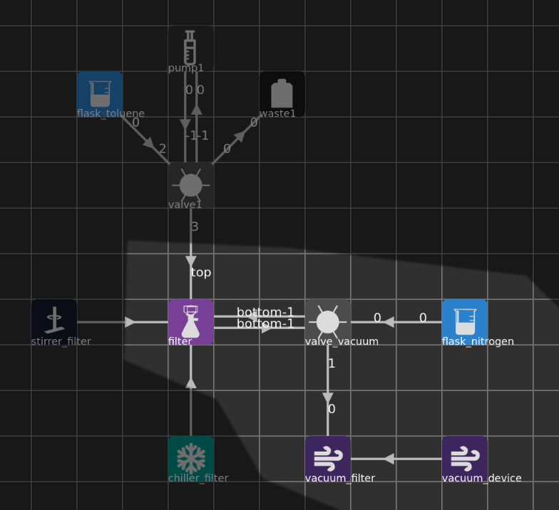
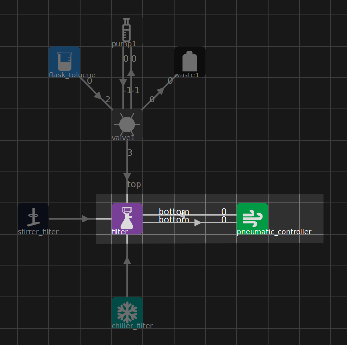

=========
The Graph
=========

The following is specific to graphs made for the Chemputer platform.

Graph editor: https://croningroup.gitlab.io/chemputer/graphapp

:download:`Template graph <template_graph.json>`

Node Types
**********

Valve
^^^^^

**Class**: `ChemputerValve`

**Valid ports**: -1, 0, 1, 2, 3, 4, 5 (-1 is the central port)

Pump
^^^^

**Class**: `ChemputerPump`

**Valid ports**: 0

Waste
^^^^^

**Class**: `ChemputerWaste`

**Valid ports**: 0

**Notes**: Even if there is only one physical waste vessel, it is acceptable to show waste in the graph as multiple nodes along the backbone for neatness.

Flask
^^^^^

**Class**: `ChemputerFlask`

**Valid ports**: 0

**Notes**: The 'chemical' property of the flask is important and should be filled
with the chemical the flask contains. If the flask is intended for use as an empty buffer
flask the chemical property should be left empty. If the flask is intended for use
as a source of gas (air, nitrogen etc), the gas should be added as the chemical, e.g. 'air', 'nitrogen' and 'argon' are all acceptable values that XDL will recognise.

Reactor
^^^^^^^

**Class**: `ChemputerReactor`

**Valid ports**: 0, 1, 2 (1, 2 only used if using a three-necked flask).

Separator
^^^^^^^^^

**Class**: `ChemputerSeparator`

**Valid ports**: 'top' or 'bottom'

Rotavap
^^^^^^^

**Class**: `IKARV10`

**Valid ports**: 'evaporate' or 'collect'

Filter
^^^^^^

**Class**: `ChemputerFilter`

**Valid ports**: 'top' or 'bottom'

Vacuum
^^^^^^

**Class**: `ChemputerVacuum` or `CVC3000`

**Valid ports**: 0 (only needed for `ChemputerVacuum`)

**Notes**: Any vacuum setup must include `ChemputerVacuum`. This node represents
a vacuum source, coming either from a vacuum line or from a device. If there is a
vacuum pump present, it should also be added to the graph with class `CVC3000`
and an edge going from the vacuum pump into the `ChemputerVacuum` node.

Additionally, all edges from others nodes should go into `ChemputerVacuum`
representing the flow of liquid.

Stirrer
^^^^^^^

**Class**: `HeiTORQUE_100`, `RZR_2052` or `IKAmicrostar75`

**Valid ports**: Ports not required.

**Notes**: Edges should go from the stirrer into the node they are stirring.

Stirrer Hotplate
^^^^^^^^^^^^^^^^

**Class**: `IKARCTDigital` or `IKARETControlVisc`

**Valid ports**: Ports not required.

**Notes**: Edges should go from the stirrer hotplate into the node they are heating/stirring.

Chiller
^^^^^^^

**Class**: `JULABOCF41` or `Huber`

**Valid ports**: Ports not required.

**Notes**: Edges should go from the chiller into the node it is chilling.

Cartridges
^^^^^^^^^^

**Class**: `ChemputerCartridge`

**Valid ports**: 'in' or 'out'

**Notes**: The 'chemical' property is important and must be set to the chemical
inside the cartridge.

Conductivity Sensor
^^^^^^^^^^^^^^^^^^^

**Class**: `ConductivitySensor`

**Valid ports**: Ports not required.

**Notes**: The only place the conductivity sensor should be used is next to the
separator witih an edge going from the sensor to the separator.

Pneumatic Controller
^^^^^^^^^^^^^^^^^^^^

**Class**: `PneumaticController`

**Valid ports**: 0, 1, 2, 3, 4, 5 (different channels)

**Notes**: Edges into the pneumatic controller should be added where vacuum is being used and edges going out of the pneumatic controller should be added where inert gas is being used.

Special Situations
******************

Buffer Flask
^^^^^^^^^^^^

Often `Separate` (and other steps) require the use of an empty 'buffer flask' to
temporarily transfer liquid to. These should be added to the graph as normal flasks
with the 'chemical' property empty.

Inert Gas Sources
^^^^^^^^^^^^^^^^^

Inert (or other) gas sources should be added as normal flasks with the gas as the
chemical property.

Acceptable values: `air`, `nitrogen`, `argon`, `Ar` or `N2`

Vacuum
^^^^^^

Vacuum can be applied to a flask in either of two ways: using a vacuum valve, or using a pneumatic controller.

The vacuum valve consists of a valve attached to the flask, which is itself attached
to an inert gas source and a vacuum. The vacuum device should be included if you are
using a vacuum pump, or left out if you are just using a vacuum line.

The other way is using the pneumatic controller.

Both of these setups are supported by XDL, anything else isn't.
